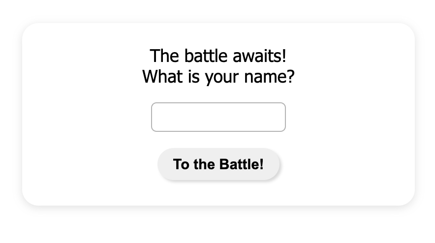

# battleship

### Front page

### Player Grid

## Access the page [here](https://benjamin-albarzendji.github.io/battleship/)

### Description

This project is the classical game of Battleship. You can play games against the computer in a complete game loop.

The project consists of several modules:

- The shipFactory.js module that create shipobjects with several methods such as alignment, size, health, is sunk and so on.
- The GameboardFactory module that creates the gameboard object with several methods that create the gameboard, places ships on the gameboard, checks if they can be placed, disables the grid and so on.
- The playerFactory module that creates the player object that in turn contains both the previous modules. The player as an object can contain a gameboard, name, if they have lost and a method for the computer to send hits to its opponent.
- The DOM module that handles every single interactivity with the DOM. It is dependent on the both player objects to properly interact with it.
- There is a full suite of tests done via JEST.

Thus the objects and functions get passed around in a closed loop that enable smooth gameplay without restarting the game.

### Thoughts:

- While the ability to place ships on specified coordinates exist within the object, it has not been connected to the DOM. Only randomize is possible at the moment.
- Computer AI could benefit from a more advaned hit algorithm.
- It is not fully flexible (yet)

### Project Technologies:

- CSS
- HTML
- JavaScript
- Webpack
- Animate CSS JS Library
- Jest
